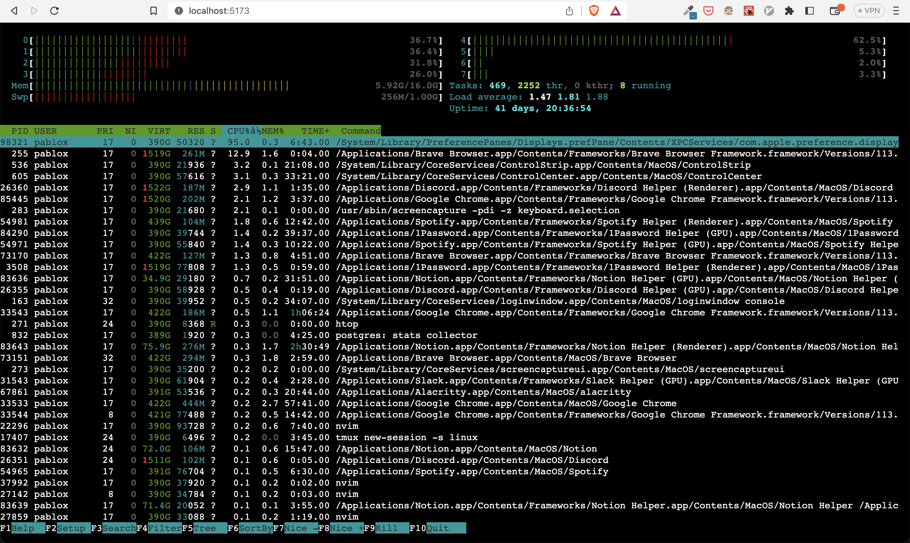

# webterm-app

`webterm-app` is an example ReactJS application that uses `xterm.js` and [`go-webterm`](https://github.com/pabloxio/go-webterm) as a backend

## Requirements

- Node >= 18.14.0

## Running

```bash
make start
up to date, audited 33 packages in 385ms

5 packages are looking for funding
  run `npm fund` for details

found 0 vulnerabilities

> dev_app@0.0.0 dev
> vite

  VITE v4.1.4  ready in 111 ms

  ➜  Local:   http://localhost:5174/
  ➜  Network: use --host to expose
  ➜  press h to show help
```

You can access the app at [http://localhost:5174](http://localhost:5174) and [`go-webterm`](https://github.com/pabloxio/go-webterm) should be running at `http://localhost:8000`:


